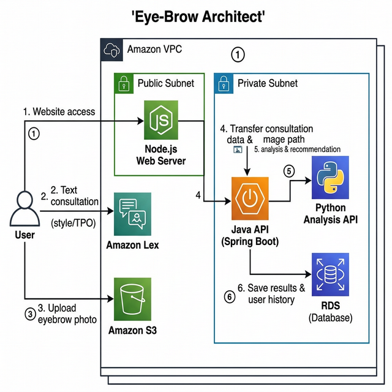
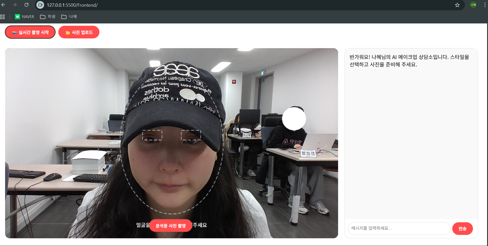
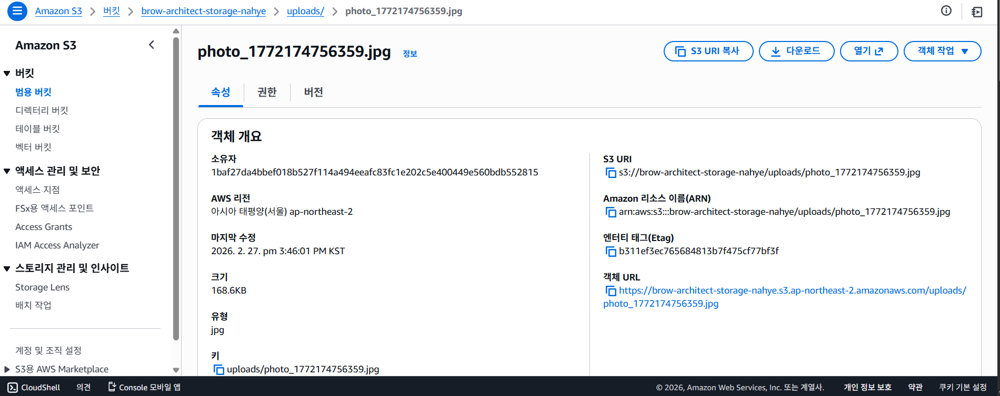
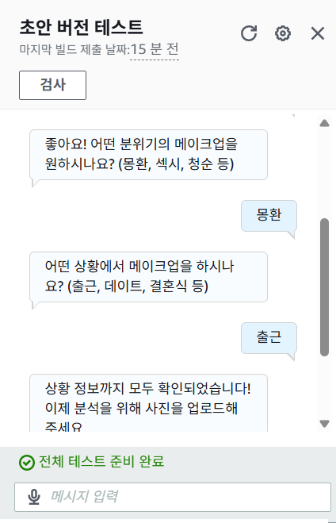
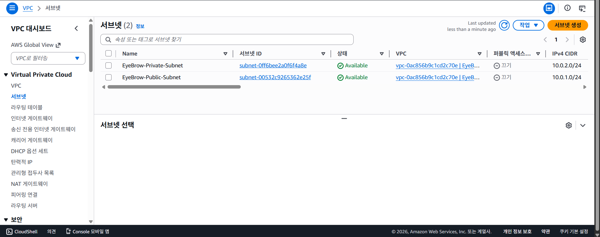
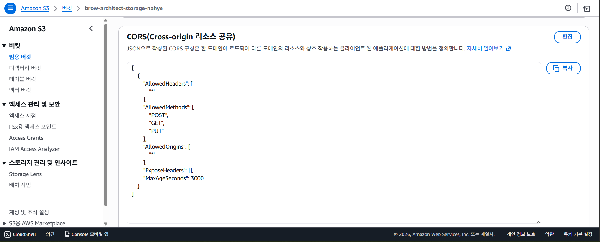
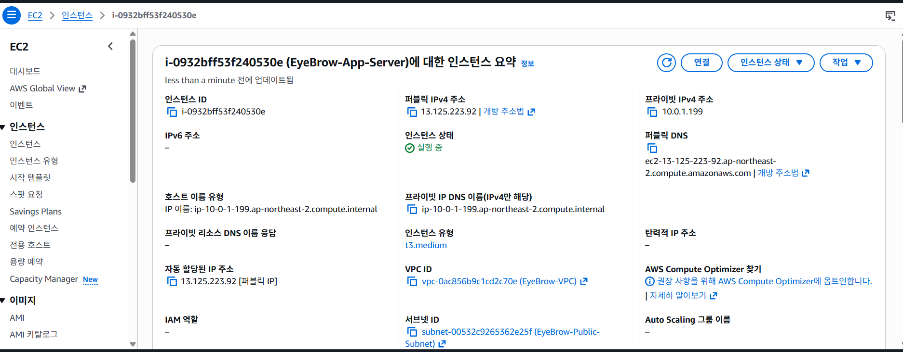
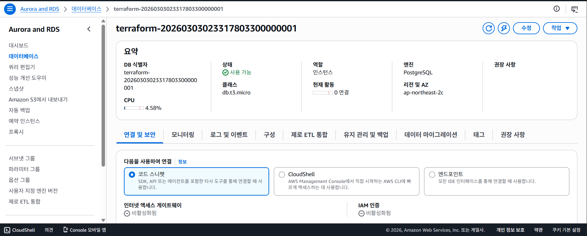
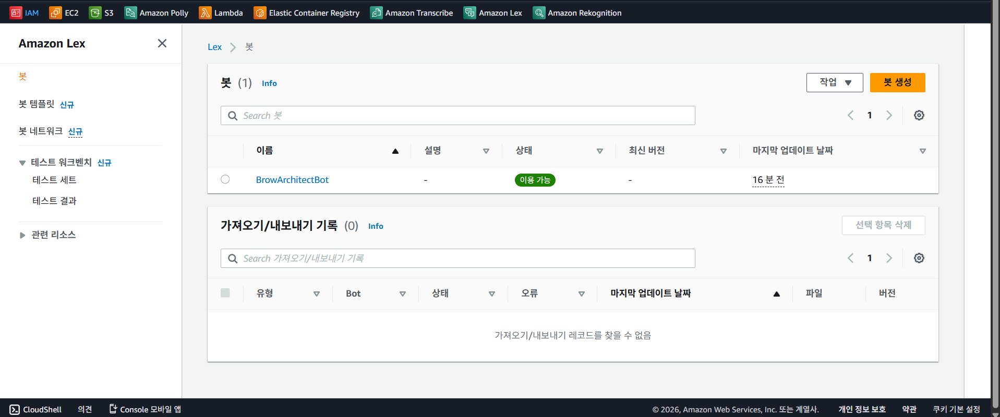

# 💄 Eye-Brow Architect: 통합 프로젝트 아키텍처

## 1. 프로젝트 개요
'Eye-Brow Architect'는 사용자의 얼굴을 분석하여 최적의 메이크업 스타일을 제안하고 상담하는 AI 서비스입니다. 프론트엔드 실시간 카메라 연동, AWS S3 이미지 저장, 그리고 Amazon Lex를 통한 지능형 상담을 결합한 통합 솔루션입니다.

---

## 2. 시스템 구성도 (Architecture Diagram)
전체 서비스의 데이터 흐름과 네트워크 구조를 시각화한 구성도입니다.

### 2.1 상세 데이터 흐름 (6단계)
1. **접속**: 사용자가 `Node.js` 웹사이트 접속 및 서비스 요청.
2. **상담**: 사용자가 `Amazon Lex`와 텍스트 상담 진행 (스타일/상황 정보 전달).
3. **업로드**: 사용자가 분석할 이미지를 `S3` 버킷에 직접 업로드.
4. **전달**: 웹 서버가 수집된 상담 데이터와 S3 이미지 경로를 `Java API`로 전달.
5. **분석**: `Java API`가 `Python API`를 호출하여 이미지 분석 및 추천 스타일 계산.
6. **저장**: 최종 분석 결과 및 사용자 이력을 `RDS`에 기록 후 사용자에게 응답.

---

## 3. 프론트엔드 기능 및 테스트 증적

### 3.1 실시간 카메라 연동 및 가이드
- **기술**: `MediaDevices API` 및 `Canvas API` 활용.
- **주요 기능**: 1280x720 실시간 스트리밍 및 얼굴/눈 위치 가이드라인 표시.

### 3.2 이미지 캡처 및 S3 업로드
- **프로세스**: 캔버스 프레임 캡처 -> Base64 변환 -> AWS SDK S3 업로드.

---

## 4. 백엔드 및 AI 서비스 (Lex 챗봇)

### 4.1 Lex 챗봇 상담 테스트 (Initial Verification)
- **내용**: 초기 `EyeBrowArchitectBot`을 통한 인벤토리 자동 전환 및 대화 시나리오 검증.
- **상태**: **[테스트 완료]** 초기 아키텍처 검증용으로 사용되었으며, 실제 서비스용 봇은 별도로 구성될 예정입니다.

---

## 5. AWS 인프라 구축 상세 명세 및 결과 (Terraform)
테라폼(IaC)을 통해 구축된 실제 AWS 리소스 현황입니다.

### 5.1 네트워크 및 보안 (VPC)
- **명세**: VPC(`10.0.0.0/16`), Public/Private 서브넷 구분 구축.
- **증적**: `EyeBrow-VPC` 및 관련 서브넷 생성 확인.

### 5.2 스토리지 (Amazon S3)
- **명세**: `brow-architect-storage-nahye` 버킷, CORS 및 권한 설정 완료.
- **증적**: 버킷 목록 및 정책 적용 확인.

### 5.3 애플리케이션 서버 (EC2)
- **명세**: `t3.medium`, `Ubuntu 22.04`, 퍼블릭 IP 할당.
- **증적**: 인스턴스 실행 상태 확인 (IP: 13.125.223.92).

### 5.4 데이터베이스 (RDS)
- **명세**: `PostgreSQL`, `db.t3.micro` 프리티어 사양.
- **증적**: DB 인스턴스 '사용 가능' 상태 확인.

### 5.5 AI 서비스 (Amazon Lex)
- **명세**: `BrowArchitectBot` 봇 생성 및 한국어 지원 설정.
- **증적**: 봇 빌드 완료 및 'Ready' 상태 확인.

---

## 6. 인프라 자동화 프로세스
- **도구**: `Terraform` (v1.14.6 이상)
- **워크플로우**: 
    1. `terraform init`: 프로바이더 및 프로젝트 초기화 (증적: image-3.png)
    2. `terraform plan`: 변경 사항 검토 및 실행 계획 생성
    3. `terraform apply`: 실제 AWS 리소스 프로비저닝 완료
