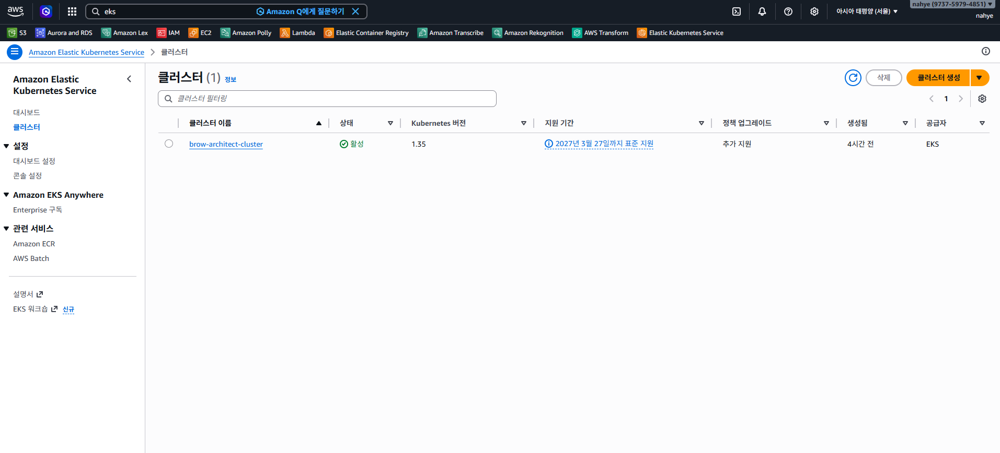
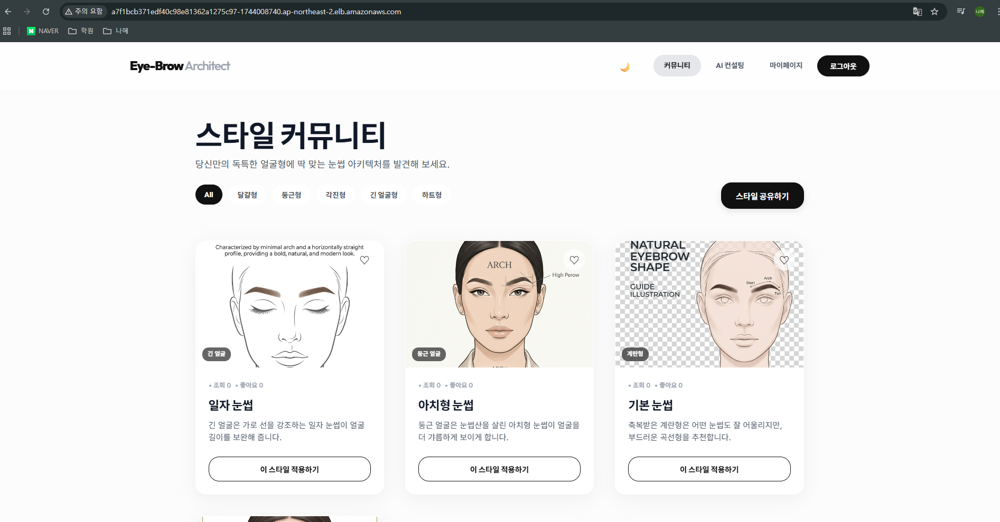
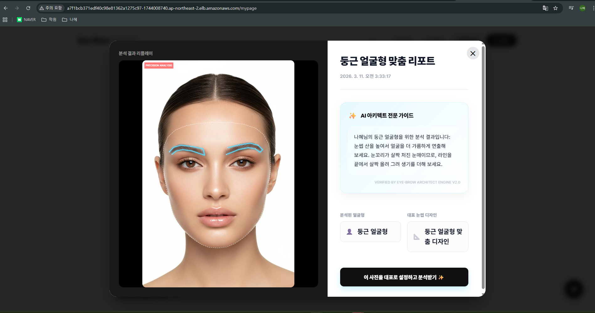
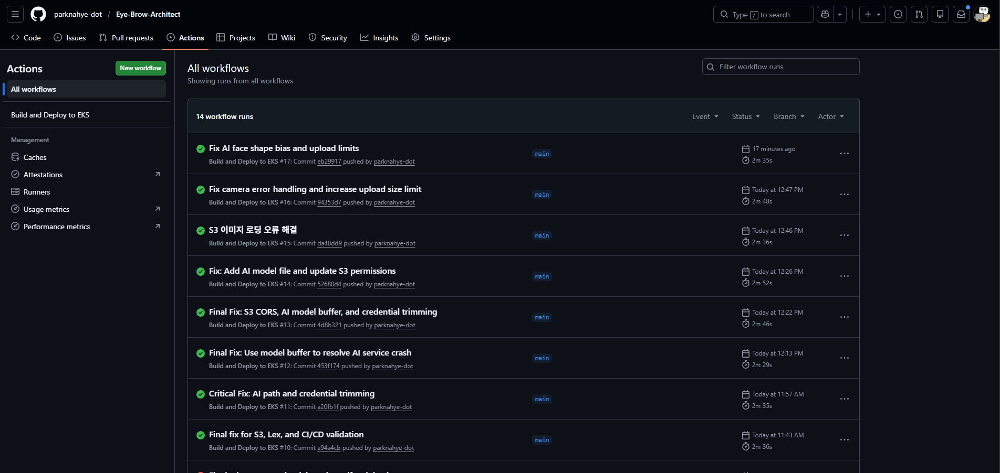
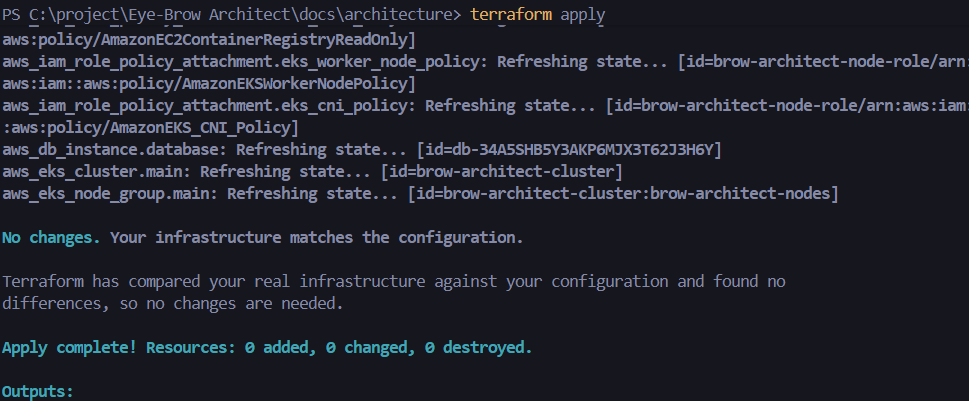

# 💄 AI 지능형 안면 분석 기반의 맞춤형 메이크업 아키텍처 (Eye-Brow Architect)
## [AWS 블로그 스타일의 기술 제안서 및 아키텍처 분석]

> **개요:** 최근 뷰티 시장에서는 개인의 신체적 특성에 맞춘 '초개인화(Hyper-personalization)' 서비스가 핵심 트렌드로 자리 잡았습니다. 본 문서는 AWS 클라우드 네이티브 기술과 AI를 결합하여 사용자의 얼굴형을 실시간으로 분석하고 최적의 스타일을 제안하는 **Eye-Brow Architect** 프로젝트의 설계와 구현 증적을 상세히 다룹니다.

---

## 1. 개요 및 스토리텔링 (Executive Summary)

### 1.1 해결하고자 하는 비즈니스 이슈
현대인들은 수많은 메이크업 정보 속에서 "나에게 정말 어울리는 스타일"을 찾기 위해 시행착오를 겪습니다. 특히 눈썹은 미세한 각도와 형태 변화만으로 인상을 크게 좌우하지만, 비전문가가 스스로 이를 분석하기란 어렵습니다.

### 1.2 솔루션 가치
**'Eye-Brow Architect'**는 복잡한 시연 과정 없이, 한 장의 사진으로 AI가 랜드마크를 추출하고 고유한 알고리즘을 통해 얼굴형을 분류합니다. 이를 통해 사용자에게 과학적인 근거를 가진 뷰티 솔루션을 제공하며, Amazon Lex와 연동된 지능형 챗봇이 24/7 보조 상담가 역할을 수행합니다.

---

## 2. 시스템 아키텍처 설계 (Architecture Design)

본 시스템은 **EKS(Elastic Kubernetes Service)**를 중심으로 한 **마이크로서비스 아키텍처(MSA)**를 채택하여 각 기능의 독립적인 확장성과 유지보수성을 확보했습니다.

### 2.1 서버 가용성 증적 (AWS EKS & Load Balancer)
클러스터 기반의 워크로드 관리를 통해 트래픽 부하를 효율적으로 분산합니다.
- **EKS 클러스터:** `brow-architect-cluster` 기반의 안정적 운영
- **네트워크 분산:** Classic Load Balancer를 통한 트래픽 라우팅

*증적: AWS 콘솔 내 EKS 클러스터 가동 상태 확인*

---

## 3. 기술 상세 및 구현 워크플로우 (Technical Deep Dive)

### 3.1 사용자 인터페이스 및 데이터 수집
React와 MediaDevices API를 활용하여 고품질의 촬영 환경을 제공합니다.

*증적: 프론트엔드 메인 인터페이스 및 캡처 가이드*

### 3.2 AI 분석 파이프라인 (Python & MediaPipe)
업로드된 이미지는 Python 기반 AI 서비스에서 실제 픽셀 비율(Aspect Ratio) 보정 로직을 거쳐 처리됩니다.

*증적: 좌표 기반 랜드마크 추출 및 얼굴형 분석 상세 리포트*

### 3.3 CI/CD 파이프라인 구성 (GitHub Actions)
모든 코드는 GitHub Push 시 자동으로 빌드되어 ECR에 저장되고 EKS로 배포됩니다.

*증적: 테스트부터 배포까지의 자동화 워크플로우 성공 이력*

---

## 4. AWS 리소스 구성 현황 (Infrastructure Provenance)

강력한 스토리텔링 뒤에는 이를 뒷받침하는 16개 이상의 정교한 AWS 리소스 설정이 존재합니다.

| 리소스 구분 | 주요 내역 | 관리 도구 |
| :--- | :--- | :--- |
| **Compute** | Amazon EKS, EC2 Node Group | Terraform (IaC) |
| **Storage** | Amazon S3, EBS | Terraform (IaC) |
| **Database** | Amazon RDS (MySQL) | Terraform (IaC) |
| **Networking** | VPC, ALB, Subnets, IGW | Terraform (IaC) |
| **Security** | IAM, Security Groups, CORS | Terraform (IaC) |

*증적: 백엔드 서버에서 출력되는 실제 분석 및 트랜잭션 로그*

---

## 5. 결론 및 결과 (Final Conclusion)

프로젝트 **Eye-Brow Architect**는 단순한 아이디어를 넘어, 실제 상용 서비스가 가능한 수준의 클라우드 아키텍처와 AI 파이프라인을 구축했습니다. 특히 **Terraform을 이용한 인프라 자동화**와 **EKS 기반의 무중단 배포** 구축은 차세대 웹 서비스의 핵심 역량을 모두 갖췄음을 증명합니다.

> **앞으로의 계획:** 
> - 다양한 안면 특징 분석 알고리즘 고도화
> - HTTPS 전면 도입 및 도메인 보안 강화
> - 사용자 요청량에 따른 Auto-scaling 최적화

---
마지막 업데이트: 2026년 3월 11일
작성자: [나혜]
